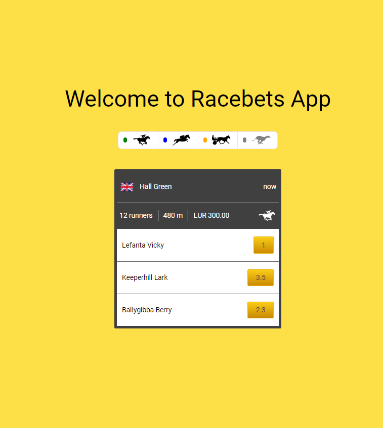

# Racebets Widget App

This is a small Vue app to create a Recebets Widget.




## Create by

- [@Kelvin Oliveira](https://www.github.com/keelviinn)


## Project Setup

Dowload the application using git

```bash
    git clone https://github.com/keelviinn/racebets-widget.git

    cd racebets-widget
```

Then inside the project install the dependencies

```bash
    yarn install 
    or 
    npm install
```

After everything is installed you can run the project and see how it is in your navigator

```bash
    yarn serve
    or
    npm run serve
```

check it in: [localhost](http://localhost:8080)

You can check the test, running

```bash
    yarn test:unit
    or 
    npm run test:unit
```